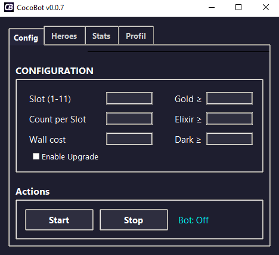
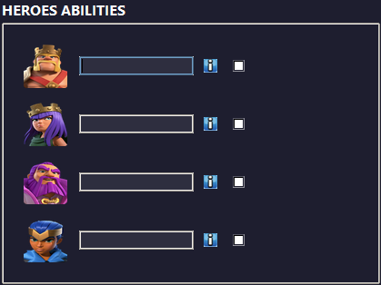
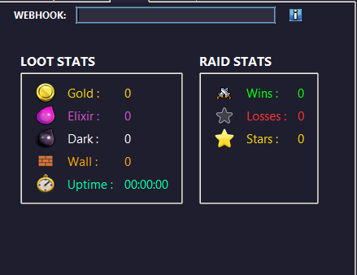
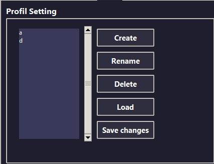

# CocoBot — Automatisation Clash of Clans

CocoBot est un bot d'automatisation pour Clash of Clans développé en Python, avec une interface graphique (Tkinter). Il permet d'automatiser des sessions d'attaque complètes : lancement des combats, placement des troupes, activation des héros, lecture des statistiques de fin de combat, et amélioration automatique des murs — le tout piloté depuis une interface de configuration simple.

## Fonctionnalités

### Attaque automatique
- Recherche et lancement automatique d'un match (`Attack` → `Find a Match`)
- Placement des troupes par **slot** configurable (1 à 11), avec un nombre de clics par slot défini par l'utilisateur
- Support des **sorts** (slot dédié avec zone de clic différente)
- Détection automatique de la direction de dézoom/drag (haut/bas) pour varier le placement
- Clics avec variation aléatoire (jitter) pour un comportement plus naturel

### Gestion des héros
- Activation programmée de 4 héros, chacun avec :
  - un délai d'activation (en secondes) personnalisable
  - une case à cocher pour l'activer/désactiver
- Détection visuelle du héros à l'écran (template matching) avant le clic

### Amélioration automatique des murs
- Détection des murs à l'écran par reconnaissance de motif (OpenCV)
- Lecture du **coût du mur** par OCR (EasyOCR) et comparaison avec la cible saisie
- Choix automatique de la ressource utilisée (or / élixir) selon les stocks disponibles
- Compteur du nombre de murs améliorés

### Lecture des statistiques (OCR)
- Lecture automatique du butin en fin de combat (or, élixir, élixir noir)
- Détection des étoiles obtenues (analyse de dominance blanche sur les zones d'étoiles)
- Comptage automatique des victoires / défaites
- Comparaison du butin détecté avec des **seuils minimums** configurables (relance automatique du match si le butin est insuffisant)

### Gestion des événements
- Support de l'événement "Treasure" (détection et séquence de clics de réclamation)
- Support du "Cake" (détection et confirmation automatique)
- Détection et clic automatique du bonus étoile

### Anti-AFK
- Thread dédié qui surveille l'apparition d'une popup AFK et la ferme automatiquement pour ne pas interrompre le bot

### Système de profils
- Création, renommage, suppression et chargement de profils de configuration
- Chaque profil sauvegarde : slots, nombre de clics, seuils de ressources, coût du mur, configuration des héros
- Sauvegarde dans un fichier `config.json` local

### Statistiques en temps réel via Discord
- Envoi automatique d'un **embed Discord** après chaque combat
- Récapitule : uptime, murs améliorés, butin total, victoires/défaites/étoiles

### Système de licence
- Interface de connexion avec clé de licence
- Vérification de la licence et de la version du bot auprès d'un serveur distant
- Identification unique de la machine (HWID) pour lier une licence à un poste
- Gestion des statuts : licence invalide, révoquée, expirée, ou version obsolète (mise à jour requise)

### Interface utilisateur
- Interface sombre en onglets : **Config**, **Heroes**, **Stats**, **Profil**
- Affichage en direct des statistiques (butin, murs, victoires/défaites, étoiles, uptime)
- Bouton d'arrêt d'urgence via raccourci clavier (**F1**)

## Stack technique

| Composant | Usage |
|---|---|
| Python / Tkinter + ttk | Interface graphique |
| OpenCV | Reconnaissance de motifs (template matching) à l'écran |
| EasyOCR | Lecture des textes/chiffres à l'écran (coûts, butin) |
| PyAutoGUI | Simulation des clics et déplacements souris |
| Requests | Communication avec le serveur de licence et les webhooks Discord |
| Pillow (PIL) | Capture et traitement d'images |
| keyboard | Raccourci d'arrêt global (F1) |
